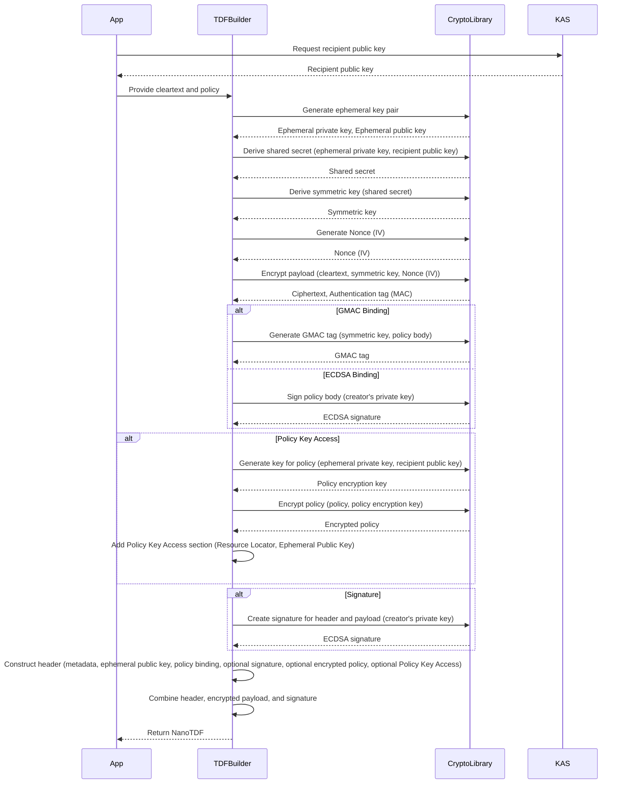
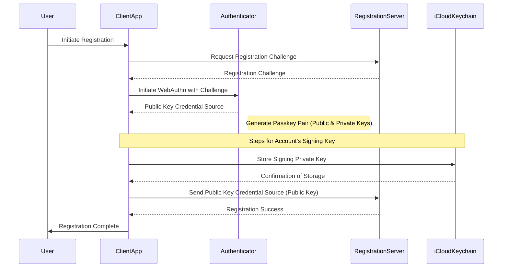
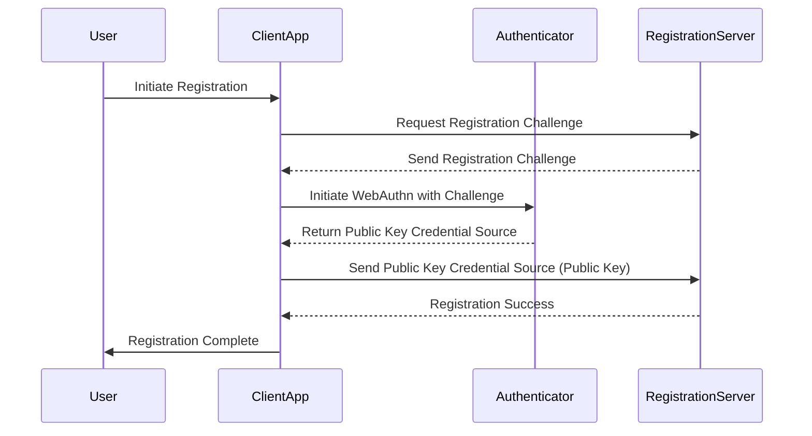

# OpenTDFKit

Swift toolkit for OpenTDF (unofficial)

## Feature

- [OpenTDF nanotdf specification](https://github.com/opentdf/spec/tree/main/schema/nanotdf)
- WebSocket rewrap

## NanoTDF creation

## Recommended Authentication

### Sign up

This sequence diagram represents the following steps:

    1.    Initiate Registration: The user initiates the registration process on the client application.
    2.    Request Registration Challenge: The client application requests a registration challenge from the registration server.
    3.    Receive Registration Challenge: The registration server responds with a registration challenge.
    4.    Initiate WebAuthn with Challenge: The client application initiates the WebAuthn process with the received challenge using the authenticator (device’s built-in secure enclave).
    5.    Create Public Key Credential Source: The authenticator generates a new key pair (public and private keys). The private key is stored securely, and the public key is returned to the client application.
    6.    Store Private Key in iCloud Keychain: The client application stores the private key in iCloud Keychain for synchronization across the user’s devices.
    7.    Confirmation of Storage: The iCloud Keychain confirms that the private key has been stored securely.
    8.    Send Public Key to Registration Server: The client application sends the public key credential source (which includes the public key) to the registration server.
    9.    Registration Success: The registration server acknowledges successful registration.
    10.    Registration Complete: The client application informs the user that the registration process is complete.

### Sign in

This diagram represents the basic WebAuthn passkey registration steps:

    1.    Initiate Registration: The user initiates the registration process on the client application.
    2.    Request Registration Challenge: The client application requests a registration challenge from the registration server.
    3.    Send Registration Challenge: The registration server responds with a registration challenge.
    4.    Initiate WebAuthn with Challenge: The client application initiates the WebAuthn process with the received challenge using the authenticator (device’s built-in secure enclave).
    5.    Return Public Key Credential Source: The authenticator generates a new key pair (public and private keys). The private key is stored securely, and the public key is returned to the client application.
    6.    Send Public Key Credential Source (Public Key): The client application sends the public key credential source (which includes the public key) to the registration server.
    7.    Registration Success: The registration server acknowledges successful registration.
    8.    Registration Complete: The client application informs the user that the registration process is complete.

