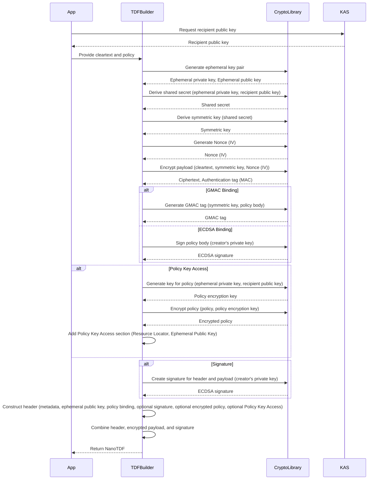

# OpenTDFKit

Swift toolkit for OpenTDF (community)

## Usage

### Decrypt NanoTDF

After obtaining the symmetric key, decrypt the NanoTDF payload:

```swift
let decryptedData = try nanoTDF.getPayloadPlaintext(symmetricKey: symmetricKey)
```

### Decrypt NanoTDF with KeyStore

For decrypting NanoTDFs using a KeyStore containing the appropriate private key:

```swift
// Most efficient way - single line decryption
let decryptedData = try await nanoTDF.getPlaintext(using: keyStore)
```

You can also use the stepped approach if you need access to the symmetric key:

```swift
// Step 1: Derive the symmetric key using the header
let symmetricKey = try await keyStore.derivePayloadSymmetricKey(header: nanoTDF.header)

// Step 2: Use the symmetric key to decrypt the payload
let decryptedData = try await nanoTDF.getPayloadPlaintext(symmetricKey: symmetricKey)
```

### Create NanoTDF

```swift
let kasRL = ResourceLocator(protocolEnum: .http, body: "kas.arkavo.net")
let kasMetadata = KasMetadata(resourceLocator: kasRL!, publicKey: publicKey, curve: .secp256r1)
let remotePolicy = ResourceLocator(protocolEnum: .sharedResourceDirectory, body: "5Cqk3ERPToSMuY8UoKJtcmo4fs1iVyQpq6ndzWzpzWezAF1W")
var policy = Policy(type: .remote, body: nil, remote: remotePolicy, binding: nil)
let nanoTDF = try createNanoTDF(kas: kasMetadata, policy: &policy, plaintext: "hello".data(using: .utf8)!)
```

## Features

- Complete [OpenTDF nanotdf specification](https://github.com/opentdf/spec/tree/main/schema/nanotdf) implementation
- Shared key distribution with PublicKeyStore
- Key unwrapping for secure decryption
- Support for multiple elliptic curves (secp256r1, secp384r1, secp521r1)
- Full backwards compatibility with v12 format while creating v13 format files

## Backwards Compatibility

OpenTDFKit implements full backwards compatibility for the security enhancements introduced in v13:

### Version Support

- **v12 (0x4C)**: Original format with 3-byte nonces (for reading old files)
- **v13 (0x4D)**: New format with 12-byte nonces (for creating new files)

### What Changed

The v13 format includes critical security improvements:
- Increased nonce size from 3 to 12 bytes for proper AES-GCM security
- HKDF-derived GMAC nonces instead of fixed zeros
- Secure random padding for nonce adjustment
- Optional salt field for enhanced key derivation

### Migration Path

1. Update to the latest version of OpenTDFKit
2. Existing v12 files can still be read without any changes
3. New files will automatically be created in v13 format with enhanced security
4. No code changes required for users of the library

The library automatically detects the format version during parsing and handles both formats transparently.

## NanoTDF creation



## Development

### Format

```shell
swiftformat --swiftversion 6.0 .
```

### Profile

```shell
swift build -c release
swift run -c release OpenTDFKitProfiler
```

## Test

### Functionality

```shell
swift test --filter KASServiceTests
```

### Performance

Run the benchmarks:

```shell
swift test --configuration release --filter "BenchmarkTests"
```

#### Performance Results

Below are the benchmark results showing the performance characteristics of the major components in OpenTDFKit:

##### KeyStore Performance

| Operation | Performance |
|-----------|------------|
| Generate and store 8192 EC521 keys | ~23 seconds total |
| Key lookup | ~0.002ms per lookup (440,000+ ops/sec) |
| Private key retrieval | ~0.003ms per retrieval (370,000+ ops/sec) |
| Serialization throughput | 408-475 MB/s (varies with key count) |

##### NanoTDF Cryptographic Operations

| Operation | Performance |
|-----------|------------|
| **Encryption by Curve Type:** | |
| - secp256r1 | ~1.1ms per operation (900+ ops/sec) |
| - secp384r1 | ~2.9ms per operation (350+ ops/sec) |
| - secp521r1 | ~7.9ms per operation (125+ ops/sec) |
| Decryption | ~0.003ms per operation (390,000+ ops/sec) |
| Signature operation | ~1.6ms per operation (630+ ops/sec) |

##### Serialization Performance

| Payload Size | Throughput |
|--------------|------------|
| 10 bytes | ~17 MB/s |
| 100 bytes | ~42 MB/s |
| 1,000 bytes | ~225 MB/s |
| 10,000 bytes | ~1.8 GB/s |

##### KAS Service Performance

| Operation | Performance |
|-----------|------------|
| KAS metadata generation | ~0.4ms per operation (2,400+ ops/sec) |
| **Key access by Curve Type:** | |
| - secp256r1 | ~1.3ms per operation (750+ ops/sec) |
| - secp384r1 | ~3.4ms per operation (290+ ops/sec) |
| - secp521r1 | ~9.4ms per operation (105+ ops/sec) |
| Policy binding verification | ~0.002ms (500,000+ verifications/sec) |

These benchmarks were measured on an Apple M1 Max processor using Swift 6.0 in release mode.


