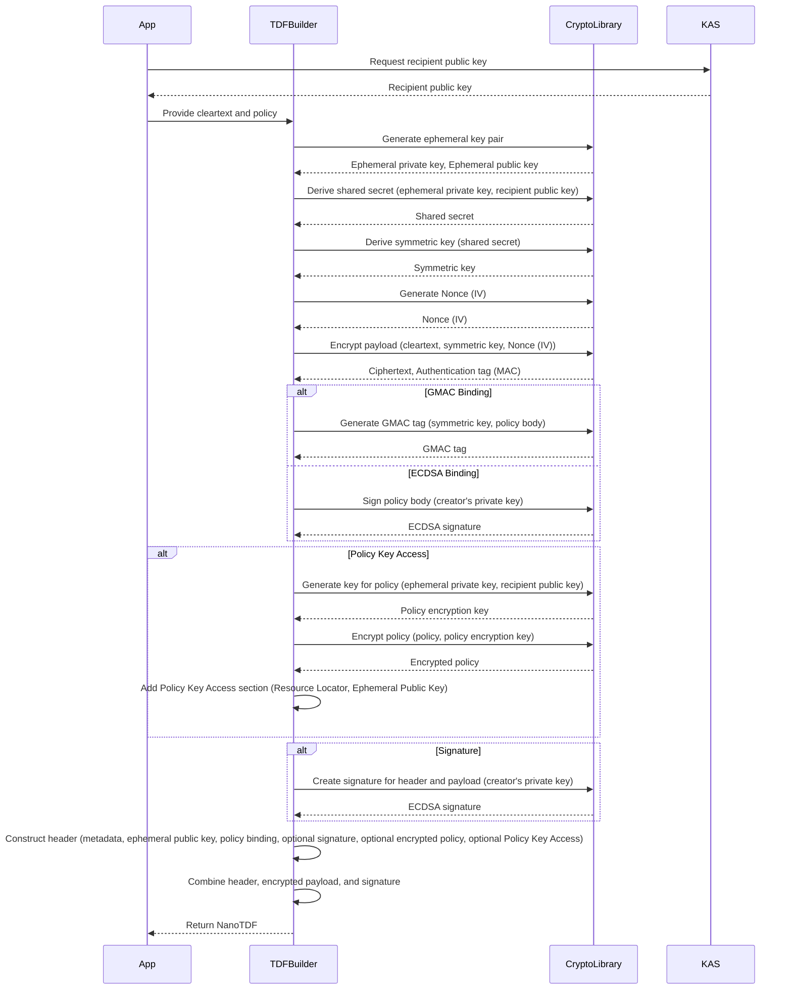

Implementation of the [OpenTDF nanotdf specification](https://github.com/opentdf/spec/tree/main/schema/nanotdf)

## NanoTDF creation sequence

```mermaid
sequenceDiagram
    participant App
    participant TDFBuilder
    participant CryptoLibrary
    participant KAS

    App->>KAS: Request recipient public key
    KAS-->>App: Recipient public key

    App->>TDFBuilder: Provide cleartext and policy
    TDFBuilder->>CryptoLibrary: Generate ephemeral key pair
    CryptoLibrary-->>TDFBuilder: Ephemeral private key, Ephemeral public key

    TDFBuilder->>CryptoLibrary: Derive shared secret (ephemeral private key, recipient public key)
    CryptoLibrary-->>TDFBuilder: Shared secret

    TDFBuilder->>CryptoLibrary: Derive symmetric key (shared secret)
    CryptoLibrary-->>TDFBuilder: Symmetric key

    TDFBuilder->>CryptoLibrary: Generate Nonce (IV)
    CryptoLibrary-->>TDFBuilder: Nonce (IV)

    TDFBuilder->>CryptoLibrary: Encrypt payload (cleartext, symmetric key, Nonce (IV))
    CryptoLibrary-->>TDFBuilder: Ciphertext, Authentication tag (MAC)

    alt GMAC Binding
        TDFBuilder->>CryptoLibrary: Generate GMAC tag (symmetric key, policy body)
        CryptoLibrary-->>TDFBuilder: GMAC tag
    else ECDSA Binding
        TDFBuilder->>CryptoLibrary: Sign policy body (creator's private key)
        CryptoLibrary-->>TDFBuilder: ECDSA signature
    end

    alt Policy Key Access
        TDFBuilder->>CryptoLibrary: Generate key for policy (ephemeral private key, recipient public key)
        CryptoLibrary-->>TDFBuilder: Policy encryption key
        TDFBuilder->>CryptoLibrary: Encrypt policy (policy, policy encryption key)
        CryptoLibrary-->>TDFBuilder: Encrypted policy

        TDFBuilder->>TDFBuilder: Add Policy Key Access section (Resource Locator, Ephemeral Public Key)
    end

    alt Signature
        TDFBuilder->>CryptoLibrary: Create signature for header and payload (creator's private key)
        CryptoLibrary-->>TDFBuilder: ECDSA signature
    end

    TDFBuilder->>TDFBuilder: Construct header (metadata, ephemeral public key, policy binding, optional signature, optional encrypted policy, optional Policy Key Access)
    TDFBuilder->>TDFBuilder: Combine header, encrypted payload, and signature
    TDFBuilder-->>App: Return NanoTDF
```